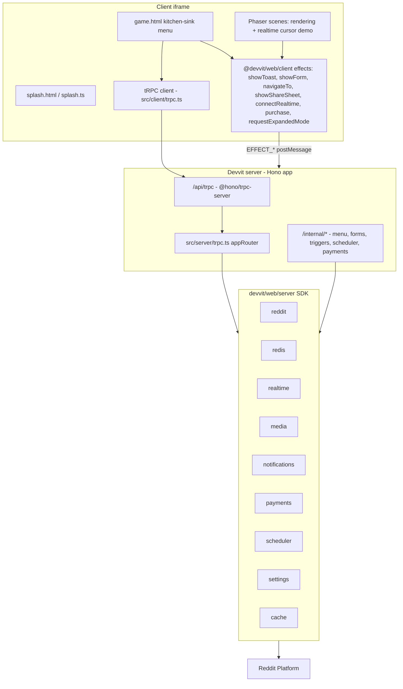

# Devvit Kitchen Sink: Illustrative Examples of Every Capability

## Goal

Convert the current minimal Phaser starter (counter demo + 1 menu item + 1 form + 1 trigger) into a learning repo with small, working, well-commented examples of every documented Devvit Web capability, callable from a categorized menu screen, and deployable via `npm run deploy`.

## Architecture

- **tRPC** (per `AGENTS.md`) becomes the typed data layer for anything the client actively calls: Reddit reads/writes, Redis demos, realtime publish, media upload, notifications, payments reads, settings reads, cache demo.
- **Plain Hono `/internal/`* routes** stay for everything Devvit itself calls by fixed URL contract per `devvit.json` (menu items, form submits, triggers, scheduler tasks, payment fulfill/refund) — these can't be tRPC procedures since Devvit posts directly to a configured endpoint with a fixed request/response shape (`UiResponse`, `TriggerResponse`, `PaymentHandlerResponse`).
- Mount via `@hono/trpc-server`'s `trpcServer({ router: appRouter, endpoint: '/api/trpc' })`, confirmed compatible with tRPC v11.

## Package changes

`package.json` — add `@trpc/server`, `@trpc/client`, `@hono/trpc-server`, `zod` (for input validation on mutations).

## Server: `src/server/trpc.ts` (new)

Define `appRouter` composed of per-category sub-routers (new `src/server/routers/*.ts` files), each procedure documented with a short comment on what Devvit capability it demonstrates:

- `**reddit` router** — `getMe` (`getCurrentUser`/`getSnoovatarUrl`), `getSubredditInfo` (`getCurrentSubreddit`), `getHotPosts` (`getHotPosts` listing), `createHelloWorldPost` (`reddit.submitCustomPost` — the explicit "hello world post" example requested), `commentOnPost` (`submitComment`), `setMyFlair` (`setUserFlair`), `getPostData`/`setPostData` (custom post state), `createShareUrl`.
- `**redis` router** — `counter` (existing get/incrBy/decrBy, kept), `hashProfile` (`hSet`/`hGetAll`), `leaderboard` (`zAdd`/`zIncrBy`/`zRange` — sorted-set leaderboard pattern), `withExpiry` (`set` with `expiration`), `transactionDemo` (`watch`/`multi`/`exec` optimistic increment), `globalScopeDemo` (`redis.global`).
- `**realtime` router** — `broadcast` (`realtime.send(context.postId, msg)` — mutation the client calls to publish; client subscribes via `connectRealtime` directly, not through tRPC).
- `**media` router** — `uploadFromUrl` (`media.upload({url, type})`, returns hosted `mediaUrl`).
- `**notifications` router** — `optIn`/`optOut` (`optInCurrentUser`/`optOutCurrentUser`), `sendTestPush` (`enqueue`), `checkOptedIn` (`isOptedIn`), `gameBadge` (`requestShowGameBadge`/`dismissGameBadge`/`getGameBadgeStatus`) — comment noting push delivery requires notifications approval.
- `**payments` router** — `listProducts` (`payments.getProducts`), `listOrders` (`payments.getOrders`) — comment noting real purchases require payments eligibility approval; `purchase()` itself is called client-side, not through tRPC.
- `**scheduler` router** — `scheduleReminder` (`scheduler.runJob({name: 'reminder', runAt, data})` — one-off job demo), `listJobs`, `cancelJob`.
- `**settings` router** — `getWelcomeMessage` (`settings.get('welcomeMessage')` — reads a moderator-configurable app setting).
- `**cache` router** — `cachedSlowValue` (wraps a fake 2s computation in `cache(fn, {key, ttl})` from `@devvit/cache`, demonstrating memoized/stale-while-revalidate reads).

`src/server/index.ts` — mount `trpcServer({ router: appRouter, endpoint: '/api/trpc' })` on `app.use('/api/trpc/*', ...)` alongside the existing `/api` and `/internal` routes.

## Server: extend existing `/internal/*` Hono routes

- `src/server/routes/menu.ts` — keep `post-create`; menu items stay focused on moderator-only, subreddit/post-scoped actions where that surface is the natural fit.
- `src/server/routes/forms.ts` — extend `example-submit`; add a second form (`richForm`) demonstrating `string`, `paragraph`, `number`, `boolean`, `select`, and `group` field types together.
- `src/server/routes/triggers.ts` — keep `onAppInstall`; add `onCommentCreate` handler that increments a Redis counter of comments seen (safe, non-destructive trigger demo).
- `src/server/routes/scheduler.ts` (new) — endpoint handlers for the `devvit.json`-registered tasks: `reminder` (one-off, DMs the triggering user via `reddit.sendPrivateMessage`) and `dailyReset` (cron, resets a Redis counter).
- `src/server/routes/payments.ts` (new) — `fulfillOrder` (grants an entitlement flag in Redis keyed by user) and `refundOrder` (revokes it), wired per the `PaymentHandlerResponse` contract.

## Config: `devvit.json`

- `permissions`: add `realtime: true`, `media: true`, `payments: true` (each defaults to `false` per the schema in `refs/devvit/packages/shared-types/src/schemas/config-file.v1.json:396-415`); verify at build time whether `redis`/`reddit` also need explicit `true` (current app already uses both without a `permissions` block, so confirm via `devvit playtest` build output rather than assuming).
- `menu.items`: keep existing, no major additions needed since most examples move to the tRPC-driven kitchen sink.
- `forms`: add `richForm: /internal/form/rich-submit`.
- `triggers`: add `onCommentCreate: /internal/triggers/on-comment-create`.
- `scheduler.tasks`: add `reminder: { endpoint: /internal/scheduler/reminder }` (no cron — triggered dynamically via `runJob`) and `dailyReset: { endpoint: /internal/scheduler/daily-reset, cron: "0 0 * * *" }`.
- `payments`: add top-level `payments` block — `productsFile: products.json`, `endpoints: { fulfillOrder: /internal/payments/fulfill, refundOrder: /internal/payments/refund }`.
- `settings`: add `subreddit: { welcomeMessage: { type: "string", label: "Welcome message shown to players" } }` (per schema at `config-file.v1.json:70-90` / `:805-832`).
- New root file `products.json` — one `DURABLE` SKU (e.g. `remove_ads`) and one `CONSUMABLE` SKU (e.g. `coin_pack_100`), per the schema at `refs/devvit/packages/shared-types/src/schemas/products.json`.

## Client

- `src/client/trpc.ts` (new) — vanilla `createTRPCProxyClient<AppRouter>({ links: [httpBatchLink({ url: '/api/trpc' })] })`. Relies on the ambient same-origin `fetch` auth patch from `@devvit/web-view-scripts` — no manual auth header needed.
- `src/client/game.html` + new `src/client/kitchenSink.ts` — replace the current single Phaser-boot flow with a categorized menu (Reddit API, Redis, Realtime, Media, Notifications, Payments, Scheduler, Settings, Cache, Forms/Client Effects, Rendering Demo). Each row: a short code comment (in the `.ts`, not narrated in the UI) + a button that calls the matching tRPC procedure or client effect + an output panel rendering the JSON result. Includes direct examples of `showToast`, `showForm` (both forms), `showLoginPrompt`, `showShareSheet`/`getShareData`, `navigateTo`, `purchase(sku)`, `exitExpandedMode`.
- `src/client/scenes/*` — keep as the "Rendering Demo" category; extend `Game.ts` minimally to call `connectRealtime({ channel: context.postId })` and `realtime.send` (via the tRPC `realtime.broadcast` mutation) so moving your cursor broadcasts position to other viewers' canvases — the one genuinely multiplayer-synced example, directly answering "devvit using realtime".
- `src/client/splash.ts` — unchanged, stays fast per `AGENTS.md` guidance.

## Shared

- `src/shared/api.ts` — superseded by tRPC's inferred types; keep only cross-cutting shared types (e.g. the realtime message shape) that both client and server import without pulling in server-only code.

## Caveats to carry into implementation

- `@devvit/scheduler`, `@devvit/settings`, and `@devvit/external-endpoints` have no source in `refs/devvit` (dependency-only); their documented method signatures above are inferred from `refs/devvit/packages/test/src/server/vitest/devvitTest.scheduler.test.ts` and `.settings.test.ts`. Verify exact signatures against installed `node_modules/@devvit/*/dist/*.d.ts` once `npm install` runs, before finalizing those routers.
- Payments and Notifications are marked `@experimental`/require Reddit approval — examples will compile and run but real delivery may fail pre-approval; comments in code will say so explicitly.
- No native example apps demonstrate client-side effects (forms/toasts/realtime/share/purchase) in `refs/devvit/packages/apps` — those examples are being written fresh based on unit-test usage patterns and inline JSDoc in `refs/devvit/packages/client/src/effects/*` and `refs/devvit/packages/realtime/src/client/realtime.ts`.

## Todos

[{"id": "deps", "content": "Add @trpc/server, @trpc/client, @hono/trpc-server, zod to package.json and install"}, {"id": "trpc-router", "content": "Create src/server/trpc.ts and src/server/routers/{reddit,redis,realtime,media,notifications,payments,scheduler,settings,cache}.ts"}, {"id": "mount-trpc", "content": "Mount trpcServer in src/server/index.ts alongside existing /internal routes"}, {"id": "extend-internal-routes", "content": "Extend menu/forms/triggers routes and add scheduler.ts + payments.ts internal route handlers"}, {"id": "devvit-json", "content": "Update devvit.json: permissions, forms, triggers, scheduler.tasks, payments, settings; add products.json"}, {"id": "client-trpc", "content": "Create src/client/trpc.ts vanilla tRPC client"}, {"id": "kitchen-sink-ui", "content": "Build categorized kitchen-sink menu UI in game.html/kitchenSink.ts wiring every example with output panels"}, {"id": "realtime-phaser-demo", "content": "Wire realtime cursor-sync demo into Phaser Game.ts scene"}, {"id": "verify-inferred-apis", "content": "After npm install, verify scheduler/settings/external-endpoints signatures against installed .d.ts files and adjust routers if needed"}, {"id": "typecheck-lint", "content": "Run npm run type-check and npm run lint, fix issues"}]