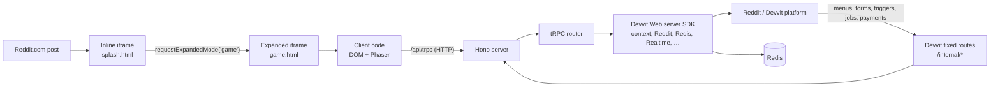
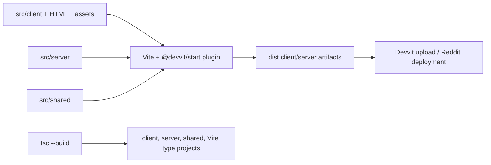

# Architecture Reference

This is a repository-specific guide to the Devvit Web application deployed on
Reddit. It covers the direct dependencies in [`package.json`](package.json),
the platform contract in [`devvit.json`](devvit.json), and the architecture in
`src/`.

## System at a glance



There are two execution environments, not one full-stack Node process:

| Environment               | Runs         | Has access to                                             | Must not do                                               |
| ------------------------- | ------------ | --------------------------------------------------------- | --------------------------------------------------------- |
| Client iframe on Reddit   | `src/client` | DOM, Phaser, Devvit client effects, tRPC client           | Import server APIs or trust client state as authoritative |
| Devvit serverless request | `src/server` | Devvit server SDK, Reddit API, Redis, Realtime, Node APIs | Depend on browser DOM or client SDK                       |
| Shared code               | `src/shared` | Pure types, constants, deterministic helpers              | Import client/server-only runtime APIs                    |

[`AGENTS.md`](AGENTS.md) supplies the repository rule: `src/server` is secure
backend code, `src/client` is the Reddit iframe, and `src/shared` is the safe
common layer.

## Entrypoints and platform configuration

[`devvit.json`](devvit.json) names the deployed client directory, server entry,
permissions, and every platform callback.

| Configured item            | Runtime role                             | Source entrypoint                                                                 |
| -------------------------- | ---------------------------------------- | --------------------------------------------------------------------------------- |
| `post.entrypoints.default` | Fast inline feed view                    | [`src/client/splash.html`](src/client/splash.html) + `splash.ts`                  |
| `post.entrypoints.game`    | Expanded post view                       | [`src/client/game.html`](src/client/game.html) + `kitchenSink.ts`                 |
| `server.entry`             | Devvit server entry                      | [`src/server/index.ts`](src/server/index.ts)                                      |
| `menu.items`               | Reddit menu callbacks                    | `/internal/menu/*` → [`routes/menu.ts`](src/server/routes/menu.ts)                |
| `forms`                    | Submitted Devvit forms                   | `/internal/form/*` → [`routes/forms.ts`](src/server/routes/forms.ts)              |
| `triggers`                 | Reddit lifecycle/content events          | `/internal/triggers/*` → [`routes/triggers.ts`](src/server/routes/triggers.ts)    |
| `scheduler.tasks`          | One-off or cron task callbacks           | `/internal/scheduler/*` → [`routes/scheduler.ts`](src/server/routes/scheduler.ts) |
| `payments.endpoints`       | Order fulfillment/refund callbacks       | `/internal/payments/*` → [`routes/payments.ts`](src/server/routes/payments.ts)    |
| `settings`                 | Platform-managed subreddit configuration | server settings router                                                            |

The inline splash calls `requestExpandedMode(event, 'game')`, which asks Reddit
to open the named expanded entrypoint. It uses Devvit client effects instead of
browser navigation, matching the Reddit embedding model.

## Runtime request paths

### Browser actions: tRPC over Hono

The client creates one typed tRPC client in
[`src/client/trpc.ts`](src/client/trpc.ts):

```ts
createTRPCClient<AppRouter>({
  links: [httpBatchLink({ url: '/api/trpc' })],
});
```

[`src/server/index.ts`](src/server/index.ts) mounts the tRPC adapter at the
same path:

```ts
app.use(
  '/api/trpc/*',
  trpcServer({ router: appRouter, endpoint: '/api/trpc' })
);
```

`AppRouter` is inferred from the server router tree in
[`src/server/routers/index.ts`](src/server/routers/index.ts). Calls such as
`trpc.redis.counter.get.query()` and `trpc.tankGame.join.mutate()` are checked
against the server at build time, without OpenAPI, generated clients, or
duplicated request/response definitions.

The Devvit web-view runtime supplies authentication for same-origin tRPC
fetches. The server remains authoritative: it reads request-scoped Devvit
`context` for the current post/user and validates client input with Zod.

### Platform callbacks: plain Hono routes

Devvit calls menu actions, submitted forms, triggers, jobs, and payments using
fixed URLs registered in `devvit.json`. These are not browser API calls and do
not need tRPC. The server creates an `internal` Hono sub-app and mounts it at
`/internal`:

```text
Devvit callback → /internal/{menu|form|triggers|scheduler|payments}/... → Hono route
```

This keeps platform URL contracts out of the browser-oriented RPC API. The app
also mounts `honoLab` at `/api/hono` as a plain Hono API demonstration.

### Realtime: server broadcasts, client fan-out

The server publishes a message through Devvit Realtime after updating state.
The browser connects once per post channel in
[`src/client/realtimeChannel.ts`](src/client/realtimeChannel.ts), then fans
messages out to local `Set`-based subscribers. The singleton/fan-out wrapper
exists because the Devvit client API retains one listener per channel; several
feature tabs still need to observe the same post channel.

Realtime synchronizes views; it is not the source of truth:

```text
client action → server validation + Redis write → realtime notification → client render
                                              └→ snapshot read/reconciliation
```

The tank game periodically reads snapshots and reloads on connection/page
visibility changes. Redis state remains authoritative if a realtime message is
missed.

## State, authority, and concurrency

### Server authority

The server trusts Devvit's request `context`, not a browser-claimed user or
post. For the tank game it obtains `context.postId`, `context.userId`, and
`context.username`, checks game rules, writes the next state, then broadcasts
the accepted state. The browser requests actions and renders returned state.

### Redis persistence

Redis stores per-post state, derived keys, counters, and example data. Shared
helpers create namespaced keys; for example,
[`tankGameKey`](src/shared/tankGame.ts#L108-L109) includes a state-schema
version and post ID.

The tank game uses optimistic transactions in
[`mutateState`](src/server/routers/tankGame.ts#L170-L206):

```text
WATCH key → read + validate current JSON → compute next state
          → MULTI + write → EXEC
          → on conflict, retry up to three times
```

Each accepted update increments a state `version`. Clients ignore stale
versions, complementing Redis conflict detection and realtime delivery.

### Validation layers

| Contract               | Enforced by         | Purpose                                                  |
| ---------------------- | ------------------- | -------------------------------------------------------- |
| Shared TypeScript type | compiler            | Editor help and safe refactors across client/server      |
| Zod schema             | server runtime      | Reject malformed or out-of-range external/persisted data |
| Game-rule function     | server runtime      | Enforce authorization and domain behavior                |
| Redis transaction      | persistence runtime | Prevent lost concurrent updates                          |

TypeScript annotations do not validate runtime data. Zod's `.parse()` validates
browser input and Redis JSON before server code trusts it.

## Client architecture

The expanded `game.html` bootstraps `kitchenSink.ts`. It is a dependency-light
vanilla-DOM application that switches among capability demos. Phaser demos and
the tank game are mounted only when their UI category needs them.

| Client component               | Responsibility                                                              |
| ------------------------------ | --------------------------------------------------------------------------- |
| `splash.html` / `splash.ts`    | Inline view; prompts expansion; Devvit navigation and context display       |
| `game.html` / `kitchenSink.ts` | Expanded page shell and categorized demo UI                                 |
| `kitchenSink/ui.ts`            | DOM helpers, button lifecycle, output/error display                         |
| `trpc.ts`                      | Single typed HTTP tRPC client                                               |
| `realtimeChannel.ts`           | One realtime connection per post plus local subscriptions                   |
| `phaserGame.ts`                | Creates and destroys the conventional Phaser scene demo                     |
| `tankGameDemo.ts`              | Tank view model, scene lifecycle, animation, snapshots, and action requests |
| `scenes/*`                     | Phaser boot/preload/menu/game/game-over scenes for the rendering demo       |

Phaser is **not** the app's state authority. It manages canvas rendering,
input, animations, cameras, and scene lifecycle; game state comes from the
tRPC/Realtime/Redis server path.

## Server architecture

[`src/server/index.ts`](src/server/index.ts) is the composition root. It
constructs Hono apps, mounts tRPC, mounts fixed Devvit routes, installs server
log capture, and passes `app.fetch` to Devvit's Node server adapter.

| Server layer            | Responsibility                                                                  |
| ----------------------- | ------------------------------------------------------------------------------- |
| `trpc.ts`               | Creates `router` and `publicProcedure`; re-exports `AppRouter` as a type import |
| `routers/*`             | Browser-callable typed API grouped by Devvit capability or game feature         |
| `routes/*`              | Devvit platform callback handlers with fixed endpoint contracts                 |
| `core/*`                | Cross-cutting helpers: post creation, event metrics, server logging             |
| `tankGameRules.ts`      | Pure geometry and turn-order rules; isolated for testability                    |
| `tankGameRules.test.ts` | Node built-in test cases for those pure rules                                   |

The router tree exposes Redis, Reddit, Realtime, media, notifications,
payments, scheduler, settings, cache, Devvit-event, logging, and tank-game
features under one browser-facing API. This kitchen-sink app is organized by
platform capability rather than a single product domain.

## Direct libraries and platform components

### Application and platform dependencies

| Library             | Used where                  | Responsibility                      | Interaction                                                                                                          |
| ------------------- | --------------------------- | ----------------------------------- | -------------------------------------------------------------------------------------------------------------------- |
| `@devvit/web`       | client and server           | Devvit Web SDK                      | Client: context, effects, navigation, realtime. Server: context, Redis, Reddit, Realtime, media, settings, and more. |
| `@devvit/start`     | `vite.config.ts`            | Devvit/Vite integration             | The `devvit()` Vite plugin builds for the Devvit Web deployment model.                                               |
| `devvit`            | npm scripts/platform config | Devvit CLI/platform package         | `playtest`, `upload`, and `publish` drive local testing and deployment.                                              |
| `vite`              | build/dev scripts           | Module bundler/build tool           | Processes HTML module entrypoints, assets, and Devvit plugin configuration.                                          |
| `typescript`        | all `.ts` files             | Static type checking                | Project references check client, server, shared, and Vite config; it does not validate runtime data.                 |
| `hono`              | server index and routes     | Small HTTP router/composition layer | Hosts tRPC and Devvit fixed callback routes.                                                                         |
| `@hono/node-server` | `server/index.ts`           | Hono Node server adapter            | Bridges the Fetch-style Hono handler to the Devvit-created Node server.                                              |
| `@hono/trpc-server` | `server/index.ts`           | tRPC-to-Hono adapter                | Mounts `appRouter` on `/api/trpc/*`.                                                                                 |
| `@trpc/server`      | server trpc/routers         | Typed RPC route definitions         | Defines procedures and derives the server router contract.                                                           |
| `@trpc/client`      | client trpc                 | Typed RPC caller                    | Builds calls using the server-derived `AppRouter` type.                                                              |
| `zod`               | server routers              | Runtime schema validation           | Checks input and persisted JSON before business logic.                                                               |
| `phaser`            | client scenes/demos         | 2D game engine                      | Owns canvas input/rendering, cameras, scene lifecycle, and animation; consumes authoritative server state.           |

`@devvit/web-view-scripts` is not a direct dependency declared by this app, but
the Devvit web-view runtime matters: its fetch integration attaches the Devvit
bearer token to same-origin client requests.

### Development and quality tooling

| Library/tool                                           | Responsibility                                                                    |
| ------------------------------------------------------ | --------------------------------------------------------------------------------- |
| `typescript-eslint`, `@eslint/js`, `globals`, `eslint` | Lint TypeScript and configure JS/browser/Node globals; run with `npm run lint`.   |
| `prettier`                                             | Formatter; `npm run prettier` rewrites files, so use it intentionally.            |
| `@types/node`                                          | Node type declarations for server code, tests, and `vite.config.ts`.              |
| Node.js 22                                             | Required runtime; `node:crypto` and `node:test` are used without extra libraries. |

`package-lock.json` contains transitive packages. They are installation details,
not separately chosen architectural components; the tables above cover every
direct dependency declared by the application.

## Build, type checking, and deployment



| Command              | What it does                                               |
| -------------------- | ---------------------------------------------------------- |
| `npm run dev`        | Starts the Devvit playtest workflow.                       |
| `npm run build`      | Runs the Vite build configured with the Devvit plugin.     |
| `npm run type-check` | Runs `tsc --build` across project references.              |
| `npm run lint`       | Runs ESLint over `src/**/*.{ts,tsx}`.                      |
| `npm run test`       | Type-checks, then runs compiled Node tests for tank rules. |
| `npm run deploy`     | Type-checks, lints, then uploads with the Devvit CLI.      |
| `npm run launch`     | Deploys, then publishes for review.                        |

The root `tsconfig.json` coordinates project references. Its base config turns
on strict nullability, unchecked-index safety, unused-code checks, and explicit
overrides. Client, server, shared, and Vite configurations supply the relevant
environment libraries and types.

## How to extend this architecture safely

| Change                                 | Primary place                                                  | Required companion work                                                                |
| -------------------------------------- | -------------------------------------------------------------- | -------------------------------------------------------------------------------------- |
| Browser feature/API call               | add or extend `src/server/routers/*`                           | compose it in `appRouter`, invoke with `trpc`, validate input with Zod                 |
| Shared state/message                   | `src/shared/*`                                                 | update server validation and client handling; preserve persisted-data compatibility    |
| Game rule                              | `src/server/tankGameRules.ts`                                  | keep it pure and add/adjust `tankGameRules.test.ts`                                    |
| Client-only interaction                | `src/client/*`                                                 | use Devvit client effects, clean up listeners and Phaser instances                     |
| Realtime feature                       | shared message union + server publisher + `realtimeChannel.ts` | keep one connection per post; use snapshots as recovery                                |
| Menu/form/trigger/job/payment callback | matching `src/server/routes/*` module                          | add the matching `devvit.json` mapping; the platform cannot call an unregistered route |
| New external/persisted input           | server router/route                                            | add runtime Zod validation; a TypeScript annotation is insufficient                    |

## Invariants worth preserving

- Browser code never imports server runtime code; `import type` is the allowed
  compile-time bridge for `AppRouter`.
- The client does not authorize game actions. Server context and rules do.
- Redis state is authoritative; realtime accelerates rendering and snapshots
  repair missed messages.
- Shared modules stay platform-neutral so both targets can import them.
- Hono's fixed `/internal` routes mirror Devvit configuration; tRPC is for
  interactive client/server calls.
- Keep the inline splash light. Phaser and other heavier code belong in the
  expanded game entrypoint or start on demand.
