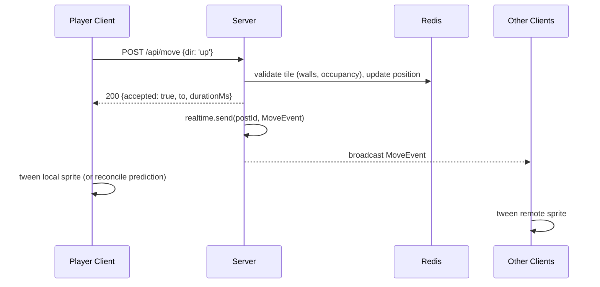

# Character Movement & Animation Architecture (Devvit Realtime)

Guidance for implementing smooth, networked character movement (e.g. a maze/room game with
multiple server-tracked characters) on top of Devvit's realtime + Redis stack. See
`DEVVIT_GAME_CAPABILITIES.md` for the underlying platform primitives and limits this design
builds on.

## The core constraint

Devvit `realtime` is **not a socket you stream continuous state over**. It's a low-frequency,
fire-and-forget, server → clients pub/sub bus (capped at ~100 msg/s, 1 MB/msg per install; see
`DEVVIT_GAME_CAPABILITIES.md` §3). Client → server communication is a regular HTTP request/response
to your `/api/*` routes, not a persistent connection. There is **no client-to-client messaging** —
every broadcast is relayed through the server.

Because of this, don't try to replicate traditional snapshot-interpolation netcode (streaming
`{x, y}` every frame). Instead: **the server sends discrete motion/action commands, and each
client animates them locally.** Network imprecision becomes a rendering problem solved with
tweens, not a bandwidth problem solved with more messages.

## Architecture at a glance



- **Server** is the only source of truth. It validates every move/action against authoritative
  state in Redis (maze walls, occupied tiles, character stats) before it happens.
- **`realtime`** is used purely as a "here's what just happened" event stream, one event per
  discrete action (a step, a door opening, an item pickup) — not a continuous state feed.
- **Clients** (including the acting player's own client) are dumb renderers: they receive events
  and play the corresponding animation/tween. No client resolves collisions or game rules itself.

## 1. Send motion, not position

Broadcast a **move event** that describes a tween, not a coordinate snapshot:

```ts
type MoveEvent = {
  type: 'move';
  charId: string;
  from: { x: number; y: number };
  to: { x: number; y: number };
  durationMs: number; // how long the walk animation should take
  seq: number;         // per-character monotonic counter
};
```

Client just runs a tween from `from` to `to` over `durationMs` — no continuous updates needed:

```ts
function onMove(evt: MoveEvent) {
  const sprite = characters.get(evt.charId);
  if (evt.seq <= sprite.lastSeq) return; // drop stale/out-of-order/duplicate events
  sprite.lastSeq = evt.seq;

  sprite.play(directionToAnim(evt.from, evt.to)); // walk-left/right/up/down
  scene.tweens.add({
    targets: sprite,
    x: evt.to.x,
    y: evt.to.y,
    duration: evt.durationMs,
    onComplete: () => sprite.play('idle'),
  });
}
```

This is a natural fit for **tile/grid-based movement** (mazes, room-based games): a move is
inherently discrete (tile A → tile B), so one event per step is sufficient, and `durationMs` can
match the walk-cycle animation length exactly.

**No clock synchronization is needed.** Because you send a *duration* rather than an absolute
timestamp, the client just starts the tween on receipt. (Only add a server timestamp if you want
to compensate for an unusually late-arriving message by shortening the remaining tween.)

## 2. Server stays authoritative; clients only "catch up visually"

All collision/rule logic (wall collisions, tile occupancy, whether an action is legal) lives
**only on the server**, checked against the maze layout and current character positions stored in
Redis. Clients never decide whether a move is legal — they only animate what the server says
already happened.

```ts
// server (pseudocode)
async function handleMove(charId: string, dir: Direction) {
  const state = await getCharacterState(charId); // from Redis
  const to = applyDirection(state.pos, dir);

  if (!isWalkable(to) || isOccupied(to)) {
    return { accepted: false };
  }

  const seq = await redis.hIncrBy(`char:${charId}`, 'seq', 1);
  await redis.hSet(`char:${charId}`, { x: to.x, y: to.y });

  const durationMs = 250; // matches walk-cycle length
  await realtime.send(postId, {
    type: 'move', charId, from: state.pos, to, durationMs, seq,
  });

  return { accepted: true, to, durationMs };
}
```

## 3. Client-side prediction for the local player only

Round-tripping to the server before animating your *own* character would feel laggy, so:

1. On input, immediately start the tween locally (optimistic).
2. Fire `POST /api/move` in parallel.
3. If the server confirms (`accepted: true` matching what you predicted), do nothing further.
4. If rejected or different, correct with a short snap-back tween. This should be rare if the
   client already knows the maze layout and roughly where other characters are.

**Remote characters get no prediction.** They are pure playback of server-broadcast events —
there's nothing to predict since you don't control their input.

## 4. Environment interactions use the same event pattern

Model interactions (opening doors, picking up items, attacking, triggering traps) as the same
kind of discrete, authoritative event as movement:

```ts
type ActionEvent = {
  type: 'action';
  actorId: string;
  action: 'open_door' | 'pickup' | 'attack';
  targetId: string;
  seq: number;
};
```

Server validates (e.g. "is actor adjacent to the door?"), mutates Redis (door state, item
ownership, health), then broadcasts. **Every** client — including the actor's own — reacts to the
event identically: play the door-open frame, remove the item sprite, trigger a hit/particle
effect. This keeps all game logic server-side; clients are just replaying "things that happened."

## 5. Robustness details specific to this transport

| Concern | Mitigation |
|---|---|
| Late joiners get no message history (`connectRealtime` only delivers future events) | Add `GET /api/state` returning the full authoritative snapshot (all character positions/facings, door/item state) for initial render, then subscribe to `realtime` for deltas |
| No documented ordering/delivery guarantees | Tag every event with a monotonic `seq` (per character or global tick); clients drop stale/duplicate/out-of-order events |
| Chattiness / undocumented rate limits | Batch same-tick updates into one message, e.g. `{ type: 'tick', moves: [...] }`, instead of one `realtime.send` per character |
| Message arrives very late | Optional: include a server timestamp and shorten the remaining tween duration to "catch up" instead of playing the full animation late |

## Summary checklist for implementing a new networked character/interaction

- [ ] Model movement as discrete steps (grid/tile) wherever possible, not continuous physics
- [ ] Server validates every move/action against Redis-backed authoritative state before broadcasting
- [ ] Broadcast **commands** (`from`/`to`/`durationMs` or `action`/`target`), never raw per-frame positions
- [ ] Client renders via Phaser tweens/animations driven entirely by incoming events
- [ ] Local player: optimistic client-side prediction + server reconciliation
- [ ] Remote characters/NPCs: no prediction, pure event playback
- [ ] Every event carries a `seq` for de-dup / stale-event rejection
- [ ] `GET /api/state` exists for late-joining clients to bootstrap full world state
- [ ] Same-tick updates are batched into one `realtime.send` call where possible
